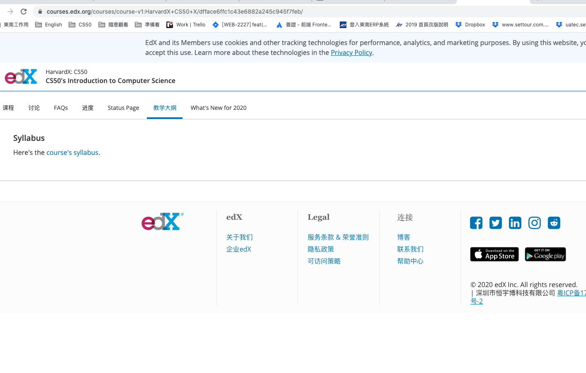

測驗
https://sandbox.cs50.io/
https://cs50.harvard.edu/x/2020/weeks/2/
https://www.youtube.com/watch?v=8PrOp9t0PyQ&t=11s


進入點

<!--  -->

Source code :
https://cs50.harvard.edu/x/2020/psets/2/


# Ｃ編譯過程
* precompiling 編譯前
* compiling 編譯
* assembling 組合
* linking

### Source code
```
#include <cs50.h>
#include <stdio.h>
int main(void) 
{
    string answer = get_string("What's your name? \n");
    printf("hello, %s\n", answer);    
}
```

經過 precompiling
```
...
string get_string(string prompt)
int printf(string format , ...)
...
int main(void) 
{
    string answer = get_string("What's your name? \n");
    printf("hello, %s\n", answer);    
}
```

----------------------

# compiling   編譯發生的事情 會經過
1. intel AMD 大廠
2. CPU 處理基礎（底層操作）
##### @main
```
...
main :
    .cfi_startproc
##### BB#0:
    pushq  %rbp
.Ltmp0:
    .cfi_def_cfa_offset16
.Ltmp2:
    subq $16, $rsp
    xorl %eax, %eax
    movl %eax, edi
```
----------------------

之後開始組合
# assembling

011010101010110011010
101010101010101010101
101010101010101010101

---------------------

# linking 
```
hello.c    cs50.c     pritf.c
01101010   0101010    0010101010

hello
010101010101010100100101001010
101010101010101010101010101101
````

若有問題發生
# linking
step 關注頂部
###  linking
buggy0.c

```
int main(void) {
    printf("hello word \n")
}
```

make buggy0
// 會跳錯
help50 make buggy0


buggy1.c
```
#include <stdio.h>

int main(void) {
    string_name = get_string("what your name? \n");
    printf("hello, %s", name);
}
```
跳錯 
help50 make buggy1

buggc2.c

```
#include <stdio.h>

int main(void) {
    for(int i =0; i<10; i++) {
        printf("#\n");
    }
}

```
./buggy2 


debug50: command not found 暫時跳過
影片 
1:12:39

-----------
複習
https://youtu.be/8PrOp9t0PyQ?t=5048

hello.c
```
#include <cs50.h>
#include <stdio.h>
int main(void) 
{
  char c1 = 'H';
  char c2 = 'I';
  char c3 = '!';
  printf("%c %c %c\n", c1, c2, c3);
  printf("%i %i %i\n", c1, c2, c3);
}

```

terminal 操作
```
make hello
./hello
```
-----------------


```
#include <cs50.h>
#include <stdio.h>

int main(void) {
    string s =get_string("Input : ");
    printf("Output: ");

    for(int i=0; s[i] != '\0'; i++) {
        printf("%c", s[i]);
    }

    printf("\n");
}

```


-------------
score3 
```
#include <cs50.h>
#include <stdio.h>

float average(int length, int array[]);

int main(void){
    int n = get_int("Scores : ");
    int scores[n];

    for(int i=0; i < n; n++) {
        scores[i] = get_int("Score %i", i + 1);
    }
    printf("Average: %.1f\n", average(n, scores));
}

float average(int length, int array[]) {
    int sum =0;
    for(int i =0; i <length; i++) {
        sum += array[i];
    }
    return (float)sum / (float)length;
}

```