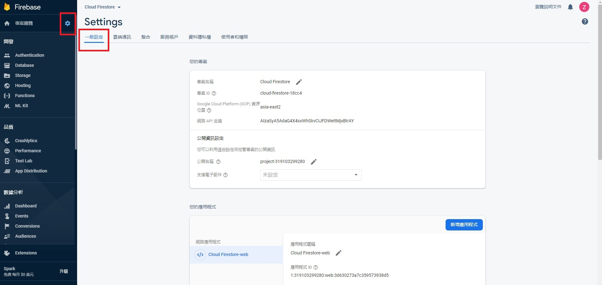
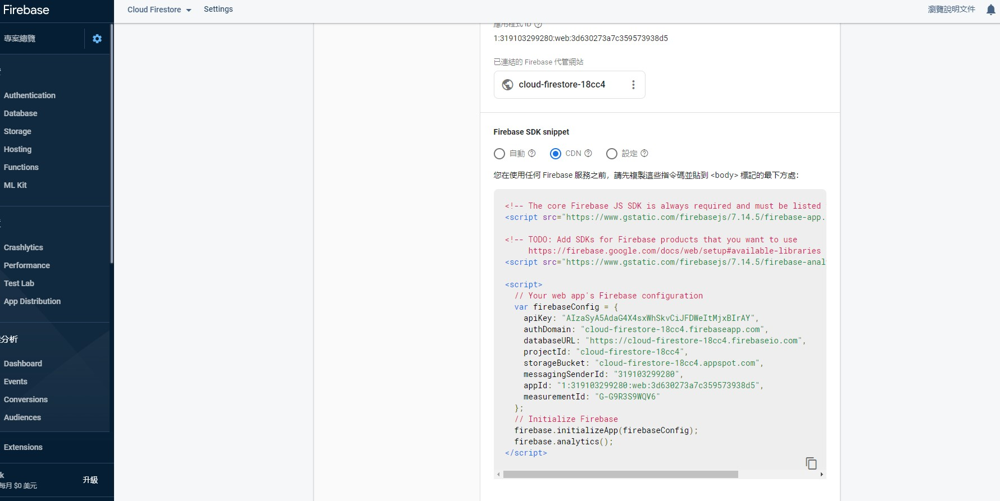
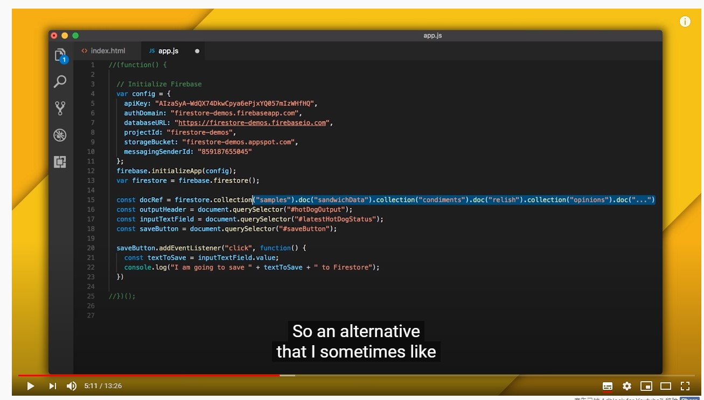
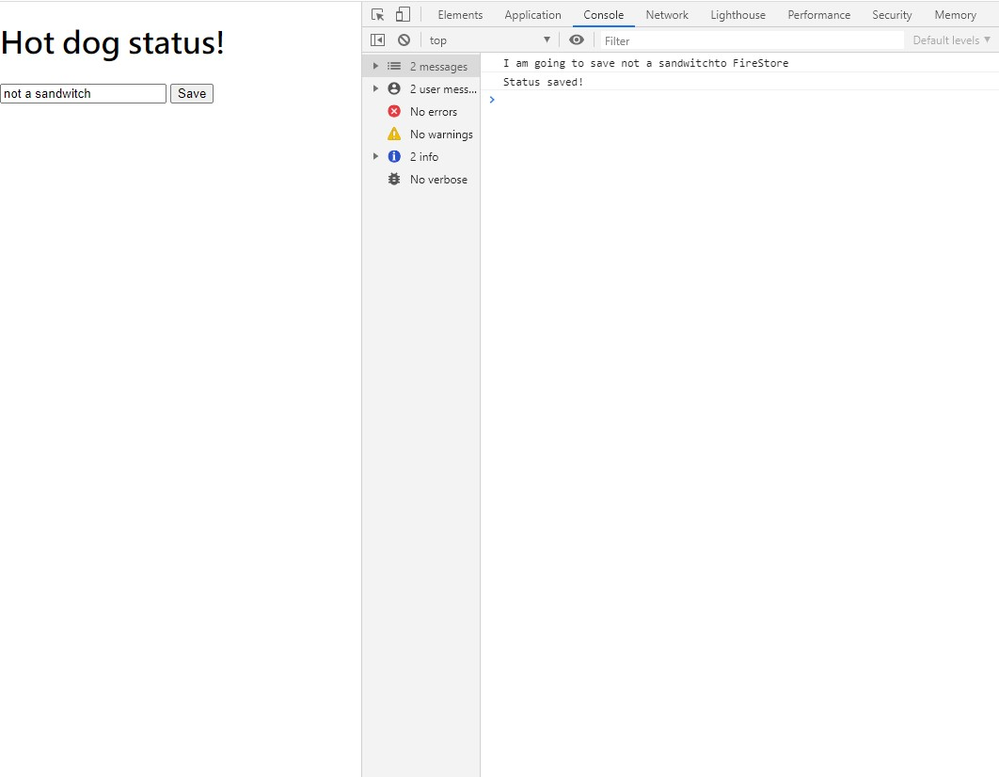
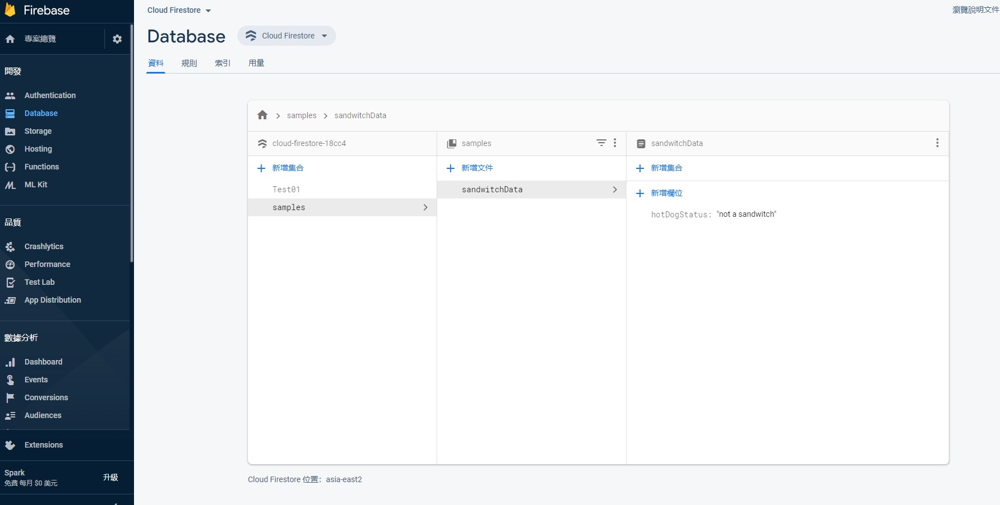
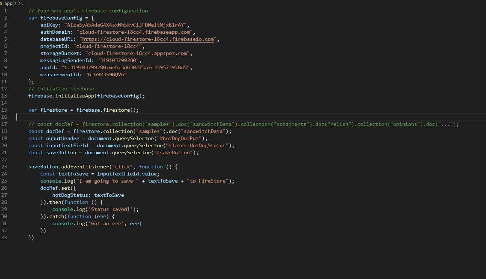
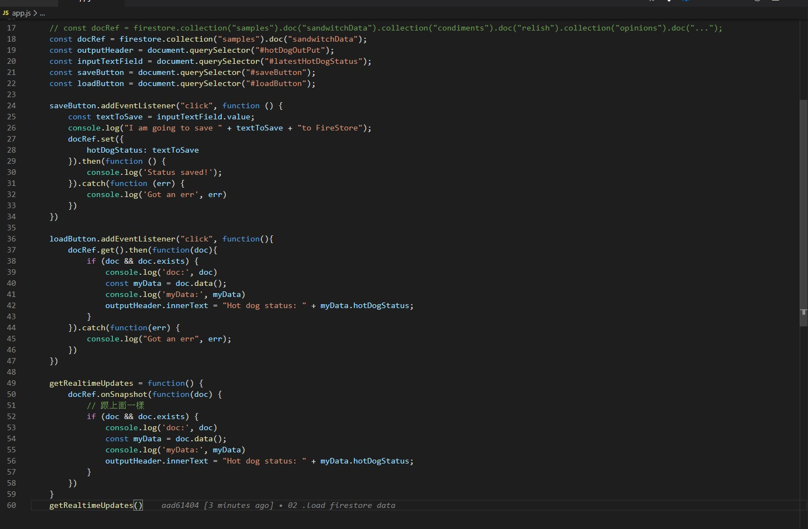

<!--  -->












https://github.com/aad61404/Cloud-FireStore-Web/commit/706e63ea8967fdb8460df95ec5bc82aa9ab08c6d

資料來源:

* 入門 realtime 
https://firebase.google.com/docs/firestore/quickstart

* doc 1 firebase store
https://firebase.google.com/docs/firestore/quickstart#web_5

* doc 2 firebase init 設定
https://firebase.google.com/docs/web/setup#available-libraries


* ptt 取材
https://medium.com/@genepan/firebase-%E7%B6%B2%E9%A0%81%E6%8E%A8%E6%92%AD%E6%8E%A1%E5%9D%91%E7%AD%86%E8%A8%98-58ab487b952e


realtime 入門 (不太重要)
```
<!-- 1 -->
<h1 id="showData"></h1>
// <!-- 1 --> ----------------
// var showData = document.getElementById('showData');
// var dbRef = firebase.database().ref().child('text');
// dbRef.on('value', snap => showData.innerHTML = snap());

```