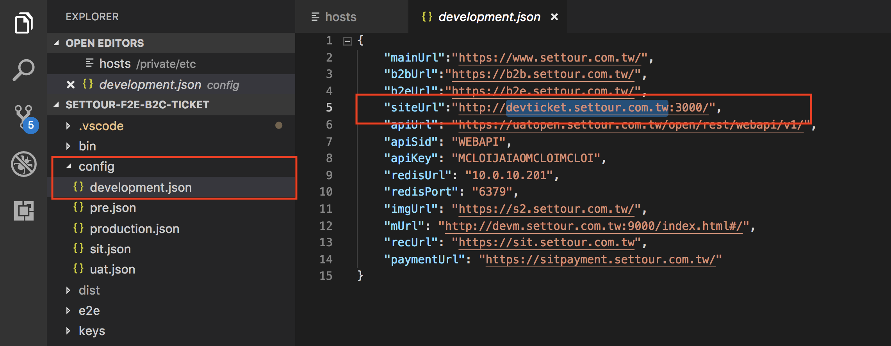
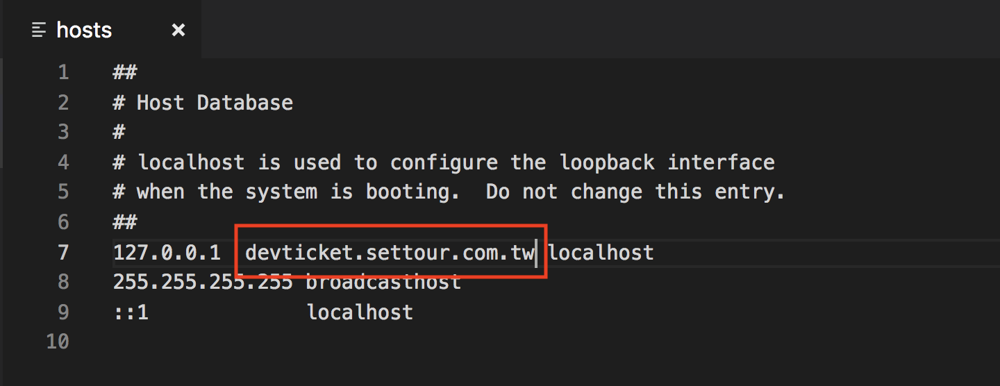
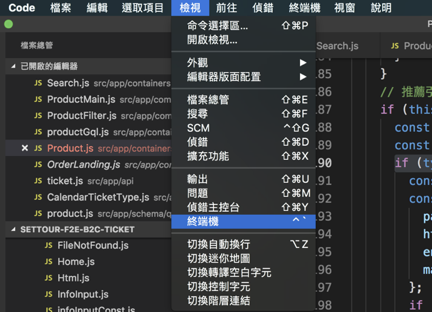
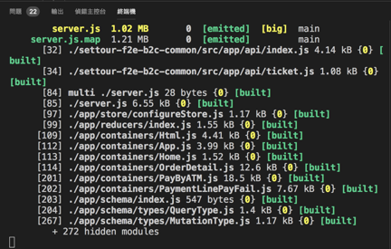
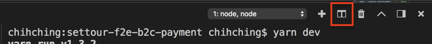
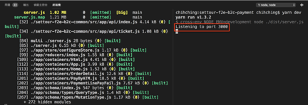
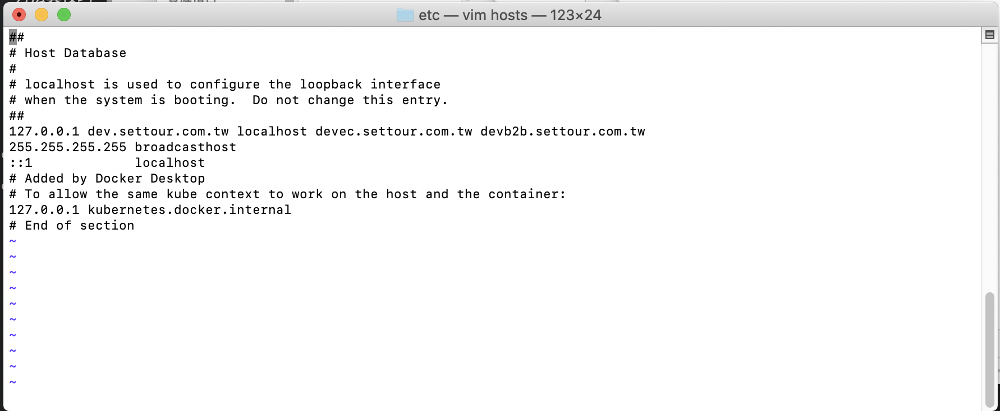

# 開發環境設定

### Bitbucket
**Clone repositories ＆ check out “develop” brach**
* settour-f2e-components-web（元件）
* settour-f2e-graphql-server（graphql）
* settour-art-prototype（CSS）
* settour-f2e-b2c-common（共用功能, 登入…）
* settour-f2e-b2c-ticket（產品線-票券）
* settour-f2e-b2c-flight（產品線-國際機票）
* settour-f2e-b2c-tour（產品線-國外團旅）
* settour-f2e-b2c-fit（產品線-自由配）
* settour-f2e-b2c-payment（產品線-付款）
* settour-f2e-b2c-tourfit（產品線-國外自由行）
* settour-f2e-b2c-visa（產品線-證照）

### Download
*  [VS Code（IDE)](https://code.visualstudio.com/) 

*  [Koala](http://koala-app.com/) 

*  [Ruby](http://rubyinstaller.org/downloads/) 

*  [Homebrew（Mac裝）](https://brew.sh/index_zh-tw.html) 
	* Install Homebrew
* /usr/bin/ruby -e “$(curl -fsSL <https://raw.githubusercontent.com/Homebrew/install/master/install>)”
* 
	* 檢查更新，保持最新狀態 brew update
*  [Yarn](https://yarnpkg.com/en/docs/install) 
	* macOS brew install yarn 若已安裝 Node.js 可執行下面指令 brew install yarn —without-node
*  [nodeJS](https://nodejs.org/en/download/)  (專案目前使用版本為 V8.9.4)

*  [Nvm (切換node版本)](https://github.com/creationix/nvm) 

*  [Sass（使用ruby下載安裝)](https://sass-lang.com/ruby-sass) 
	* Mac: Terminal sudo gem install sass
	* Windows: Command line gem install sass

### 啟動環境
修改hosts設定: /private/etc/hosts (Mac檔案位置) 在127.0.0.1 後加上 **siteUrl**
siteUrl：請至專案下 config/development.json 查看siteUrl設定
**e.g. 票券settour-f2e-ticket**
專案下查看siteUrl設定 :devticket.settour.com.tw

在127.0.0.1 後加上devticket.settour.com.tw

### 專案執行
開啟”檢視” -> “終端機”

* yarn install 安裝套件 如有server啟不來的情況可能是有新套件/套件更新, 就要做這件事
* yarn watch 執行結果如圖

* 切第二個視窗

* 第二個視窗輸入 yarn dev（執行到有3000的出現才表示成功）
* **瀏覽器輸入 本機url:port**
* 本機啟動連線的url -> config/development.json內的siteUrl再加上port (port如右圖)

**  有出現票券搜尋頁表示成功～～** [http://devticket.settour.com.tw:3000/search](http://devticket.settour.com.tw:3000/search) 

host 設定
